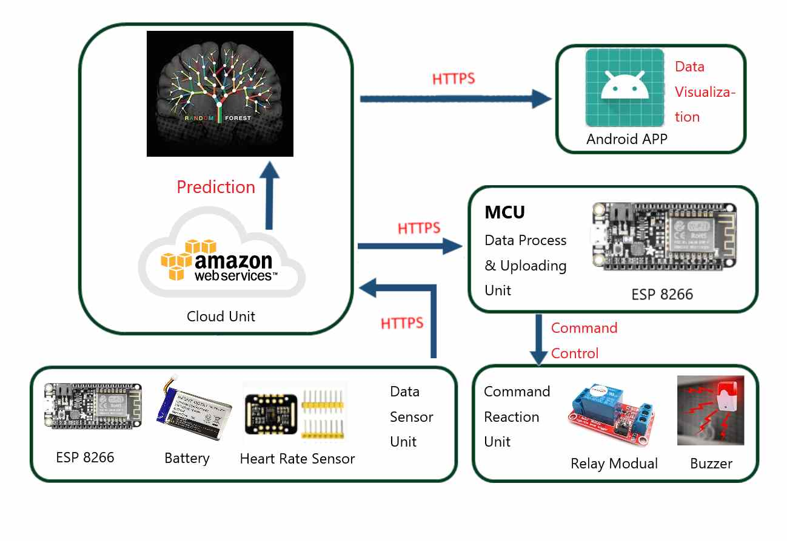

# EarlyWarningSystemForSAS

### Architecture

One ESP8266 reads raw Photoplethysmography(PPG) data from MAX30102 sensor via I2C bus and send raw data into the cloud via API post requests. A Lithium battery is uesed to power the unit.

The cloud calculate the heart rate and use random forest to predict whether the user is under the risk of Sleep Apnea Syndrome(SAS). Both data will be stroed in MongoDB.

Another ESP8266 preodically (once per 2 second) send API get requests to cloud to get prediction result. If the prediction is the patient is under risk of SAS, the ESP8266 will send signal to the relay module. The relay module will close the circuit with an alarm. The ESP8266 will also send an alarming twitter via API post requests at the same time.

Our app can present real-time heart rate data, daily summary, and real-time SAS prediction by sending API get request to cloud.

### Software Component

#### Embeded

Our group wrote all the codes for 2 ESP8266 MCU in MicroPython. We also used I2C bus to transfer raw data from MAX30102 heat rate sensor module.

#### Cloud

The original data are analyzed and predicted by random forest. We used the dataset from PhysioNet website maintained by MIT. The accuracy of prediction is about 92%. After prediction, if the result shows that the user is under the risk of apnea, the AWS will send a command to the control part to ring the alarm.

#### Application

Our group wrote and built the Android App via Android Studio in Java. The application will request the heart rate data from the cloud server, and draw the real-time heart rate diagram on the app. We can also see some summary values and the patient's condition on the app.
